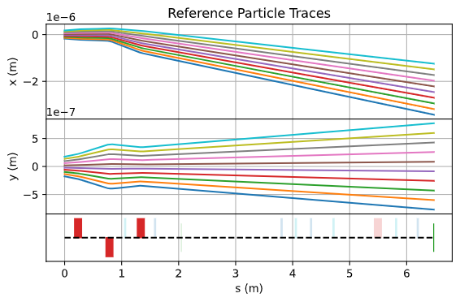

[](https://cheetah-accelerator.readthedocs.io/en/latest/?badge=latest)
[](https://github.com/psf/black)

<!-- [](https://gitlab.com/araffin/stable-baselines3/-/commits/master) -->

# Cheetah

Cheetah is a particle tracking accelerator we built specifically to speed up the training of reinforcement learning models.

## Installation

Simply install _Cheetah_ from PyPI by running the following command.

```bash
pip install cheetah-accelerator
```

## How To Use

A sequence of accelerator elements (or a lattice) is called a `Segment` in _Cheetah_. You can create a `Segment` as follows

```python
segment = Segment(
    elements=[
        BPM(name="BPM1SMATCH"),
        Drift(length=torch.tensor(1.0)),
        BPM(name="BPM6SMATCH"),
        Drift(length=torch.tensor(1.0)),
        VerticalCorrector(length=torch.tensor(0.3), name="V7SMATCH"),
        Drift(length=torch.tensor(0.2)),
        HorizontalCorrector(length=torch.tensor(0.3), name="H10SMATCH"),
        Drift(length=torch.tensor(7.0)),
        HorizontalCorrector(length=torch.tensor(0.3), name="H12SMATCH"),
        Drift(length=torch.tensor(0.05)),
        BPM(name="BPM13SMATCH"),
    ]
)
```

Alternatively you can create a segment from an Ocelot cell by running

```python
segment = Segment.from_ocelot(cell)
```

All elements can be accesses as a property of the segment via their name. The strength of a quadrupole named _AREAMQZM2_ for example, may be set by running

```python
segment.AREAMQZM2.k1 = torch.tensor(4.2)
```

In order to track a beam through the segment, simply call the segment like so

```python
outgoing_beam = segment.track(incoming_beam)
```

You can choose to track either a beam defined by its parameters (fast) or by its particles (precise). _Cheetah_ defines two different beam classes for this purpose and beams may be created by

```python
beam1 = ParameterBeam.from_parameters()
beam2 = ParticleBeam.from_parameters()
```

It is also possible to load beams from Ocelot `ParticleArray` or Astra particle distribution files for both types of beam

```python
ocelot_beam = ParticleBeam.from_ocelot(parray)
astra_beam = ParticleBeam.from_astra(filepath)
```

You may plot a segment with reference particle traces bay calling

```python
segment.plot_overview(beam=beam)
```



where the optional keyword argument `beam` is the incoming beam represented by the reference particles. Cheetah will use a default incoming beam, if no beam is passed.

## Cite Cheetah

To cite Cheetah in publications:

```bibtex
@inproceedings{stein2022accelerating,
    title        = {Accelerating Linear Beam Dynamics Simulations for Machine Learning Applications},
    author       = {Stein, Oliver and Kaiser, Jan and Eichler, Annika},
    year         = 2022,
    booktitle    = {Proceedings of the 13th International Particle Accelerator Conference},
    url          = {https://github.com/desy-ml/cheetah}
}
```

## For Developers

Activate your virtual environment. (Optional)

Install the cheetah package as editable

```sh
pip install -e .
```

We suggest installing pre-commit hooks to automatically conform with the code formatting in commits:

```sh
pip install pre-commit
pre-commit install
```
