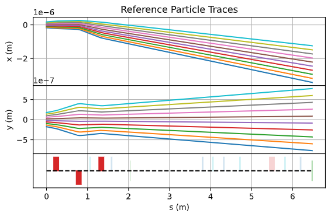

.. Cheetah documentation master file, created by
   sphinx-quickstart on Fri May 19 10:20:01 2023.
   You can adapt this file completely to your liking, but it should at least
   contain the root `toctree` directive.

Welcome to Cheetah's documentation!
===================================

.. toctree::
    :maxdepth: 2
    :caption: Contents:

    accelerator
    dontbemad
    particles
    track_methods
    utils

`Cheetah <https://github.com/desy-ml/cheetah>`_ is a particle tracking accelerator we built specifically to speed up the training of reinforcement learning models.

Github repository: https://github.com/desy-ml/cheetah

Paper: https://accelconf.web.cern.ch/ipac2022/papers/wepoms036.pdf

Installation
------------

Simply install *Cheetah* from PyPI by running the following command.

.. code-block:: bash

    pip install cheetah-accelerator

How To Use
----------

A sequence of accelerator elements (or a lattice) is called a `Segment` in *Cheetah*. You can create a `Segment` as follows

.. code-block:: python

    segment = Segment([
        BPM(name="BPM1SMATCH"),
        Drift(length=1.0),
        BPM(name="BPM6SMATCH"),
        Drift(length=1.0),
        VerticalCorrector(length=0.3, name="V7SMATCH"),
        Drift(length=0.2),
        HorizontalCorrector(length=0.3, name="H10SMATCH"),
        Drift(length=7.0),
        HorizontalCorrector(length=0.3, name="H12SMATCH"),
        Drift(length=0.05),
        BPM(name="BPM13SMATCH"),
    ])

Alternatively you can create a segment from an Ocelot cell by running

.. code-block:: python

    segment = Segment.from_ocelot(cell)

All elements can be accesses as a property of the segment via their name. The strength of a quadrupole named *AREAMQZM2* for example, may be set by running

.. code-block:: python

    segment.AREAMQZM2.k1 = 4.2

In order to track a beam through the segment, simply call the segment like so

.. code-block:: python

    outgoing_beam = segment(incoming_beam)

You can choose to track either a beam defined by its parameters (fast) or by its particles (precise). *Cheetah* defines two different beam classes for this purpose and beams may be created by

.. code-block:: python

    beam1 = ParameterBeam.from_parameters()
    beam2 = ParticleBeam.from_parameters()

It is also possible to load beams from Ocelot `ParticleArray` or Astra particle distribution files for both types of beam

.. code-block:: python

    ocelot_beam = ParticleBeam.from_ocelot(parray)
    astra_beam = ParticleBeam.from_astra(filepath)

You may plot a segment with reference particle traces bay calling

.. code-block:: python

    segment.plot_overview(beam=beam)

where the optional keyword argument `beam` is the incoming beam represented by the reference particles. Cheetah will use a default incoming beam, if no beam is passed.

Cite Cheetah
------------

To cite Cheetah in publications:

.. code-block:: bibtex

    @inproceedings{stein2022accelerating,
        author = {Stein, Oliver and
                Kaiser, Jan and
                Eichler, Annika},
        title = {Accelerating Linear Beam Dynamics Simulations for Machine Learning Applications},
        booktitle = {Proceedings of the 13th International Particle Accelerator Conference},
        year = {2022},
        url = {https://github.com/desy-ml/cheetah},
    }

For Developers
--------------

Activate your virtual envrionment. (Optional)

Install the cheetah package as editable

.. code-block:: sh

    pip install -e .

We suggest to install pre-commit hooks to automatically conform with the code formatting in commits:

.. code-block:: sh

    pip install pre-commit
    pre-commit install

Indices and tables
==================

* :ref:`genindex`
* :ref:`modindex`
* :ref:`search`
